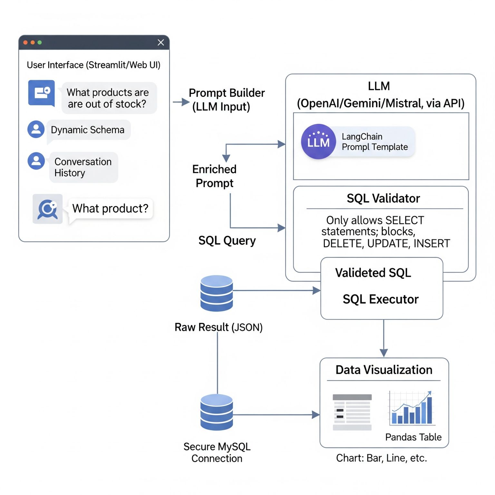
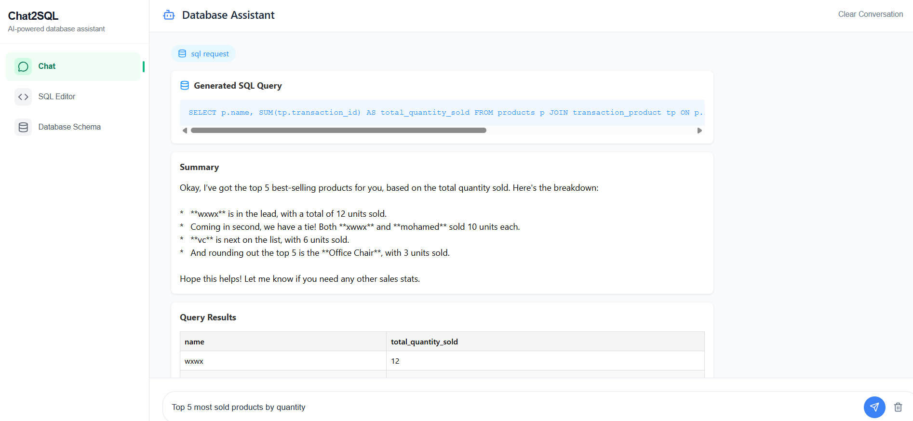
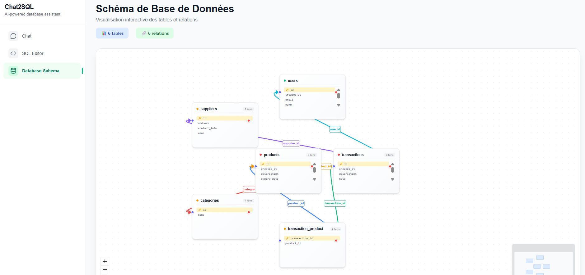
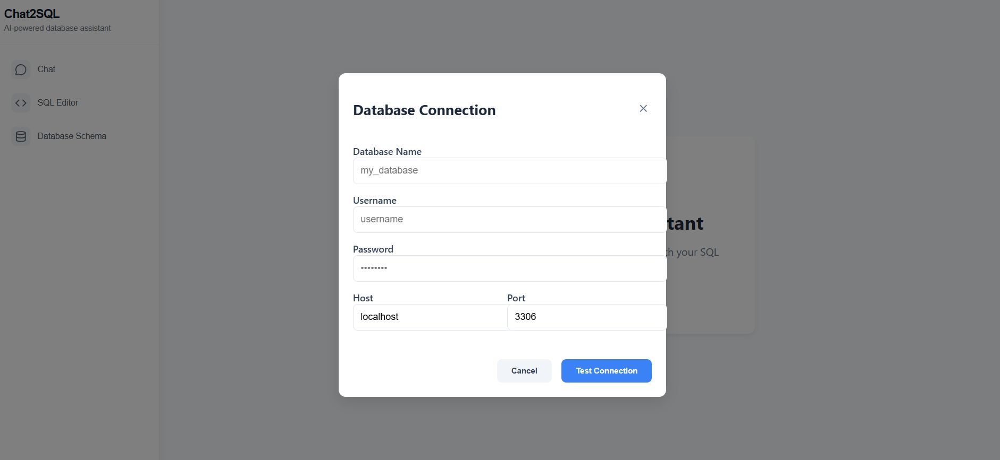

# 🤖 Chat Bot with SQL Database

Un chatbot intelligent qui permet d'interagir avec une base de données MySQL en langage naturel, alimenté par Google Gemini AI et LangChain.

## 📋 Description

Ce projet permet aux utilisateurs de poser des questions en langage naturel sur leur base de données MySQL. Le bot:
- 🧠 Comprend les intentions de l'utilisateur (requête SQL vs conversation générale)
- 🔍 Génère automatiquement les requêtes SQL appropriées
- 📊 Exécute les requêtes sur la base de données
- 💬 Reformule les résultats en français de manière claire et compréhensible
- 🧮 Garde une mémoire conversationnelle pour un contexte continu

## 📸 Captures d'Écran

### Interface Principale


### Chat en Action


### Visualisation des Résultats


### Configuration de la Base de Données


## 🏗️ Architecture


```
chat_bot/
├── src/src/              # Backend Python (Flask + LangChain)
│   ├── app.py           # Application Flask principale
│   ├── config.py        # Configuration (API keys, DB)
│   ├── db.py            # Gestion de la base de données MySQL
│   ├── llm.py           # Intégration LangChain + Gemini
│   ├── prompt.py        # Templates de prompts
│   └── utils.py         # Utilitaires
├── webapp/              # Frontend React
│   ├── src/
│   │   ├── components/  # Composants réutilisables
│   │   ├── pages/       # Pages principales
│   │   └── services/    # Services API
│   └── package.json
├── images/              # Images et captures d'écran
└── .venv/               # Environnement virtuel Python
```

## 🛠️ Technologies Utilisées

### Backend
- **Python 3.13+**
- **Flask** - Framework web
- **LangChain** - Framework pour applications AI
- **Google Gemini** - Modèle de langage
- **PyMySQL** - Connecteur MySQL
- **python-dotenv** - Variables d'environnement
- **LangSmith** - Monitoring et tracing

### Frontend
- **React 18** - Framework UI
- **React Router DOM** - Navigation
- **Lucide React** - Icônes
- **React Flow Renderer** - Visualisation des flux
- **Tailwind CSS** (si configuré)

## 🚀 Installation

### Prérequis
- Python 3.13+
- Node.js 16+
- MySQL Server
- Clés API Gemini et LangSmith

### Configuration du Backend

1. **Cloner et naviguer**
   ```bash
   git clone https://github.com/mohamedamine050/Chat_2_SQL-Naturel-language-to-SQL-.git
   cd Chat_2_SQL
   ```

2. **Créer l'environnement virtuel**
   ```bash
   python -m venv .venv
   .venv\Scripts\activate  # Windows
   # source .venv/bin/activate  # Linux/Mac
   ```

3. **Installer les dépendances Python**
   ```bash
   pip install flask flask-cors pymysql python-dotenv langchain google-generativeai langsmith
   ```

4. **Configuration des variables d'environnement**
   
   Créer un fichier `.env` à la racine :
   ```env
   # Google Gemini
   GEMINI_API_KEY=votre_cle_api_gemini
   
   # LangSmith (optionnel, pour le monitoring)
   LANGSMITH_API_KEY=votre_cle_langsmith
   LANGSMITH_PROJECT=nom_du_projet
   
   # MySQL Database
   MYSQL_HOST=localhost
   MYSQL_USER=root
   MYSQL_PASS=votre_mot_de_passe
   MYSQL_DB=nom_de_votre_db
   ```

### Configuration du Frontend

1. **Naviguer vers webapp**
   ```bash
   cd webapp
   ```

2. **Installer les dépendances**
   ```bash
   npm install
   ```

## 🏃‍♂️ Lancement de l'Application

### Démarrer le Backend
```bash
cd src/src
python app.py
```
Le serveur Flask démarre sur `http://localhost:5000`

### Démarrer le Frontend
```bash
cd webapp
npm start
```
L'application React démarre sur `http://localhost:3000`

## 📝 API Endpoints

### Backend REST API

| Endpoint | Méthode | Description |
|----------|---------|-------------|
| `/` | GET | Status de l'API |
| `/affiche_schema` | GET | Récupère le schéma de la DB |
| `/execute-sql` | POST | Exécute une requête SQL |
| `/connect_db` | POST | Test de connexion DB |
| `/query` | POST | Traite une question en langage naturel |

### Exemple d'utilisation `/query`

```javascript
POST /query
Content-Type: application/json

{
  "question": "Combien de produits avons-nous en stock ?"
}
```

**Réponse:**
```json
{
  "intent": "sql_request",
  "question": "Combien de produits avons-nous en stock ?",
  "query": "SELECT COUNT(*) as total FROM products WHERE stock > 0",
  "result": {
    "status": "success",
    "data": [{"total": 245}]
  },
  "summary": "Vous avez actuellement 245 produits en stock dans votre base de données."
}
```

## 🎯 Fonctionnalités

### Classification d'Intention
- **`sql_request`** - Questions nécessitant une requête SQL
- **`general_chat`** - Conversation générale
- **`unclear`** - Question ambiguë

### Génération SQL Intelligente
- Analyse du schéma de la base de données
- Génération de requêtes SQL optimisées
- Gestion des erreurs et validation

### Mémoire Conversationnelle
- Maintient le contexte entre les questions
- Permet des conversations fluides et naturelles

### Interface Utilisateur
- Interface chat intuitive
- Visualisation des résultats
- Gestion des schémas de base de données

## 🔧 Configuration Avancée

### Base de Données
Assurez-vous que votre base de données MySQL:
- Est accessible avec les credentials fournis
- Contient des données de test
- A les bonnes permissions pour l'utilisateur

### Prompts Personnalisés
Modifiez `prompt.py` pour adapter les prompts à votre domaine métier spécifique.

### Monitoring avec LangSmith
LangSmith permet de tracer et monitorer les requêtes LLM:
1. Créez un compte sur [LangSmith](https://smith.langchain.com)
2. Ajoutez vos clés dans `.env`
3. Consultez les traces dans le dashboard LangSmith

## 🐛 Dépannage

### Problèmes Courants

1. **Erreur de connexion MySQL**
   - Vérifiez les credentials dans `.env`
   - Assurez-vous que MySQL est démarré
   - Testez la connexion avec un client MySQL

2. **Erreur API Gemini**
   - Vérifiez votre clé API
   - Assurez-vous d'avoir des crédits disponibles
   - Testez dans Google AI Studio

3. **CORS errors**
   - Vérifiez que Flask-CORS est configuré
   - Frontend et backend sur les bons ports

## 📚 Exemples d'Utilisation

### Questions Types
- "Montre-moi tous les produits"
- "Quel est le chiffre d'affaires du mois dernier ?"
- "Quels sont les clients les plus actifs ?"
- "Combien d'employés travaillent dans le département IT ?"

### Conversations
- "Bonjour !" → Réponse de salutation
- "Comment ça va ?" → Conversation générale
- "Peux-tu m'aider ?" → Explication des capacités

## 🔜 Améliorations Futures

- [ ] Support de PostgreSQL et autres SGBD
- [ ] Interface d'administration pour gérer les connexions
- [ ] Export des résultats (CSV, Excel)
- [ ] Graphiques et visualisations avancées
- [ ] Authentification utilisateur
- [ ] API REST complète avec documentation Swagger
- [ ] Tests unitaires et intégration
- [ ] Déploiement Docker

## 🤝 Contribution

1. Fork le projet
2. Créez une branche feature (`git checkout -b feature/AmazingFeature`)
3. Committez vos changements (`git commit -m 'Add some AmazingFeature'`)
4. Push vers la branche (`git push origin feature/AmazingFeature`)
5. Ouvrez une Pull Request

## 📄 Licence

Ce projet est sous licence MIT. Voir le fichier `LICENSE` pour plus de détails.

## 👥 Auteurs

- **Votre Nom** - Développeur principal

## 🙏 Remerciements

- Google Gemini pour l'IA conversationnelle
- LangChain pour le framework LLM
- Flask pour l'API backend
- React pour l'interface utilisateur#


